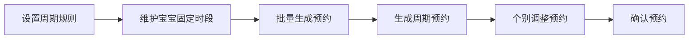
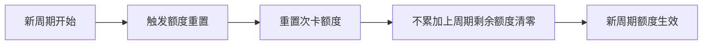

## 1. 产品概述

婴儿游泳馆预约与会员管理系统，为婴儿游泳馆提供完整的排期预约、会员额度管控、消费记录一体化管理平台。解决宝宝按固定周期批量生成预约，会员次卡额度周期重置，支持超额自费转换。

- 核心目标：实现泳池排期自动化、会员额度精细化管理、消费记录可追溯
- 目标用户：婴儿游泳馆运营管理人员、前台接待人员

## 2. 核心功能

### 2.1 用户角色

| 角色 | 注册方式 | 核心权限 |
|------|----------|----------|
| 管理员 | 系统预置 | 全部功能管理、数据配置、报表查看 |
| 前台操作员 | 管理员创建 | 预约管理、会员查询、消费登记 |

### 2.2 功能模块

1. **泳池排期**：泳池建档、时段设置、预约日历、预约调整
2. **周期生成**：周期规则设定、批量生成预约、预约单独调整
3. **额度管控**：会员管理、次卡管理、额度发放、周期重置、超额自费
4. **消费明细**：消费记录、水温消毒记录、数据统计

### 2.3 页面详情

| 页面名称 | 模块名称 | 功能描述 |
|----------|----------|----------|
| 首页概览 | 数据看板 | 今日预约数、在泳人数、本月收入统计、待处理提醒 |
| 泳池排期 | 泳池管理 | 泳池建档（名称、容量、适用月龄、状态管理 |
| 泳池排期 | 预约日历 | 周视图/日视图展示预约情况，支持拖拽调整 |
| 周期生成 | 周期规则 | 设置周期类型（周/月）、周期开始日、批量生成 |
| 周期生成 | 宝宝管理 | 宝宝信息管理、固定时段设置、批量生成预约 |
| 额度管控 | 会员管理 | 会员信息、次卡类型、剩余次数、到期时间 |
| 额度管控 | 额度重置 | 周期初自动重置额度、手动调整、超额自费转换 |
| 消费明细 | 消费记录 | 每次消费详情、扣费类型（额度/自费、金额 |
| 消费明细 | 水温消毒 | 每日水温记录、消毒记录、责任人 |

## 3. 核心流程

### 3.1 周期预约生成流程



### 3.2 消费扣减流程

```mermaid
flowchart LR
    A["宝宝到店"] --> B["检查会员额度"] --> C{"有剩余额度？"] --> C -- "是" --> D["扣减次卡额度"] --> E["记录消费"]
    C -- "否" --> F["自费支付"] --> E
```

### 3.3 额度重置流程



## 4. 用户界面设计

### 4.1 设计风格

- **主色调**：柔和水蓝色 (#4FC3F7，体现婴儿游泳馆温馨、专业的品牌调性
- **辅助色**：浅粉色、浅橙色作为点缀色，柔和不刺眼
- **背景色**：淡蓝色渐变背景，营造水波荡漾的水感氛围
- **按钮风格**：圆角大圆角设计，柔和友好，3D 轻微立体效果
- **字体**：圆润无衬线字体，清晰易读，标题使用圆润字体
- **布局风格**：卡片式布局，柔和阴影，圆角卡片
- **图标风格**：线性图标，柔和圆角，蓝色系配色
- **整体调性**：温馨、柔和、专业、安全、干净

### 4.2 页面设计概览

| 页面名称 | 模块名称 | UI元素 |
|----------|----------|--------|
| 首页概览 | 数据看板 | 渐变背景、数据卡片、统计图表、柔和阴影 |
| 泳池排期 | 预约日历 | 周视图日历、时间轴、彩色预约卡片、拖拽交互 |
| 周期生成 | 宝宝管理 | 列表卡片、头像、标签、状态徽章 |
| 额度管控 | 会员管理 | 卡片列表、进度条、次卡信息 |
| 消费明细 | 数据表格 | 表格、筛选、状态标签、分页 |

### 4.3 响应式

- 桌面端优先设计，适配平板设备
- 侧边导航 + 主内容区布局
- 平板端自适应调整

### 4.4 交互细节

- 页面加载时卡片渐入动画
- 按钮悬停柔和放大效果
- 日历预约卡片拖拽阴影变化
- 数据变化数字滚动动画
- 模态框淡入淡出

## 5. 数据模型

### 核心数据实体

- **泳池(Pool)：id, 名称, 容量, 适用月龄范围, 状态
- **宝宝(Baby)：id, 姓名, 性别, 月龄, 家长姓名, 联系电话, 会员卡号
- **预约(Appointment)：id, 宝宝id, 泳池id, 日期, 开始时间, 结束时间, 状态
- **次卡(MemberCard)：id, 宝宝id, 卡类型, 总次数, 剩余次数, 周期类型, 生效日期
- **消费记录(Consumption)：id, 宝宝id, 预约id, 消费类型, 金额, 时间
- **水温消毒记录(WaterRecord)：id, 泳池id, 日期, 水温, 消毒情况, 记录人
- **周期规则(CycleRule)：id, 周期类型, 开始日, 名称
