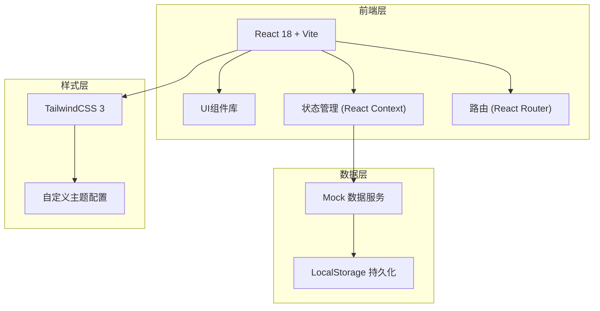
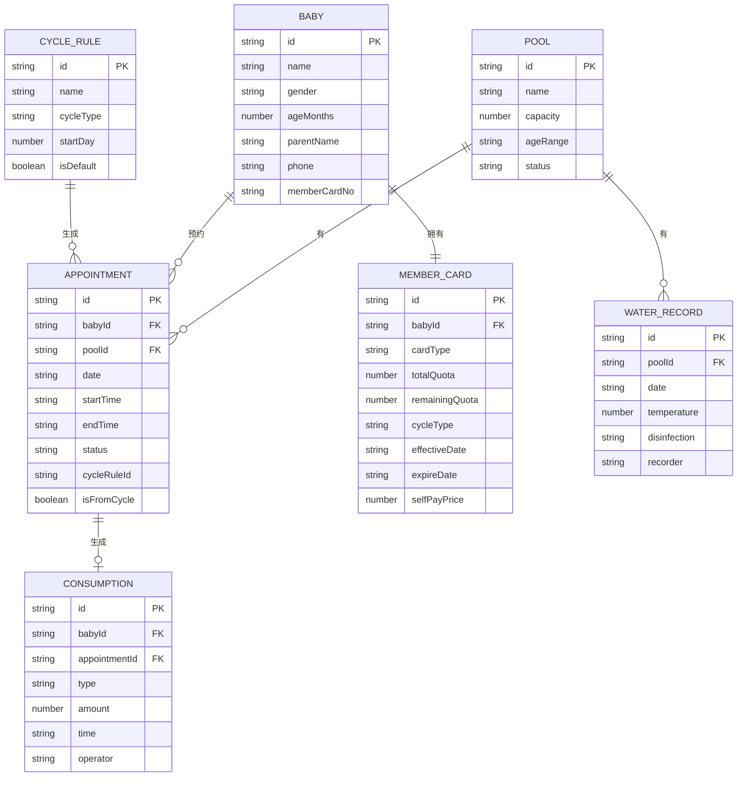

## 1. 架构设计



## 2. 技术选型

- **前端框架**：React 18 + TypeScript
- **构建工具**：Vite 5
- **样式方案**：TailwindCSS 3 + 自定义主题
- **路由方案**：React Router v6
- **状态管理**：React Context + useReducer
- **图标方案**：Lucide React
- **图表方案**：Recharts
- **日期处理**：date-fns
- **数据持久化**：LocalStorage
- **Mock 数据**：前端模拟数据服务

## 3. 路由定义

| 路由路径 | 页面名称 | 说明 |
|---------|----------|------|
| /dashboard | 首页概览 | 数据看板、今日统计 |
| /pool-schedule | 泳池排期 | 预约日历、泳池管理 |
| /cycle-generator | 周期生成 | 周期规则、宝宝管理、批量生成 |
| /quota-management | 额度管控 | 会员管理、次卡管理、额度重置 |
| /consumption | 消费明细 | 消费记录、水温消毒记录 |

## 4. 目录结构

```
src/
├── components/          # 通用组件
│   ├── Layout/         # 布局组件
│   ├── Card/           # 卡片组件
│   ├── Table/          # 表格组件
│   ├── Modal/          # 弹窗组件
│   └── Calendar/       # 日历组件
├── pages/              # 页面组件
│   ├── Dashboard/      # 首页概览
│   ├── PoolSchedule/   # 泳池排期
│   ├── CycleGenerator/ # 周期生成
│   ├── QuotaManagement/# 额度管控
│   └── Consumption/    # 消费明细
├── context/            # 状态管理
├── types/              # TypeScript 类型定义
├── utils/              # 工具函数
├── data/               # Mock 数据
├── hooks/              # 自定义 Hooks
├── App.tsx
├── main.tsx
└── index.css
```

## 5. 数据模型

### 5.1 ER 图



### 5.2 TypeScript 类型定义

```typescript
// 泳池
interface Pool {
  id: string;
  name: string;
  capacity: number;
  ageRange: string;
  status: 'active' | 'inactive' | 'maintenance';
}

// 宝宝
interface Baby {
  id: string;
  name: string;
  gender: 'male' | 'female';
  ageMonths: number;
  parentName: string;
  phone: string;
  memberCardNo: string;
  fixedSchedule?: FixedSchedule[];
}

// 固定时段
interface FixedSchedule {
  dayOfWeek: number;
  startTime: string;
  endTime: string;
  poolId: string;
}

// 预约
interface Appointment {
  id: string;
  babyId: string;
  poolId: string;
  date: string;
  startTime: string;
  endTime: string;
  status: 'scheduled' | 'completed' | 'cancelled' | 'no-show';
  cycleRuleId?: string;
  isFromCycle: boolean;
}

// 次卡
interface MemberCard {
  id: string;
  babyId: string;
  cardType: string;
  totalQuota: number;
  remainingQuota: number;
  cycleType: 'weekly' | 'monthly';
  effectiveDate: string;
  expireDate: string;
  selfPayPrice: number;
  lastResetDate?: string;
}

// 消费记录
interface Consumption {
  id: string;
  babyId: string;
  appointmentId?: string;
  type: 'quota' | 'self-pay' | 'other';
  amount: number;
  time: string;
  operator: string;
  remark?: string;
}

// 水温消毒记录
interface WaterRecord {
  id: string;
  poolId: string;
  date: string;
  temperature: number;
  disinfection: string;
  recorder: string;
  recordTime: string;
}

// 周期规则
interface CycleRule {
  id: string;
  name: string;
  cycleType: 'weekly' | 'monthly';
  startDay: number;
  isDefault: boolean;
}
```
